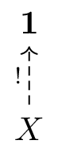
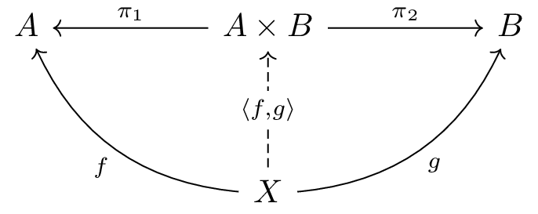
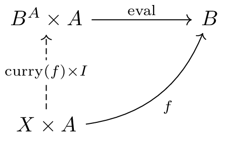
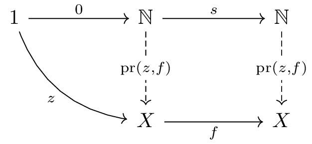
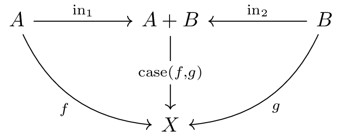
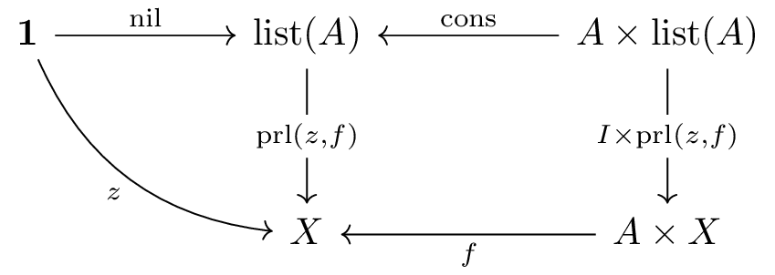
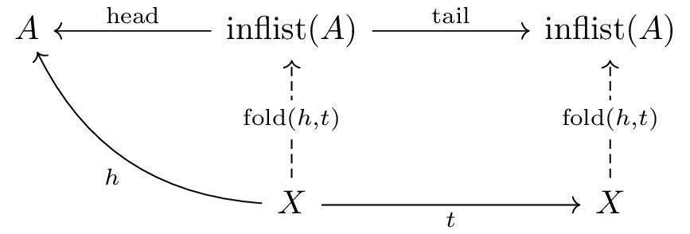

# CPL チュートリアル

## はじめに

CPL (Categorical Programming Language) は、圏論の概念に基づいて設計されたプログラミング言語です。CPLでは、通常のプログラミング言語で「データ型」や「関数」と呼ばれるものが、圏論における「対象」と「射」として扱われます。

|集合論|関数型プログラミング|CPL|
|-|-|-|
|集合|データ型|対象|
|写像|関数|射|

### CPLの特徴

- **圏論的なデータ型定義**: すべてのデータ型は、随伴 (adjunction) と F-(余)代数 (F-(co)algebra) を一般化した F,G-両代数 (F,G-dialgebra) という圏論の概念を用いて定義されます
- **型安全性**: 圏論の理論に基づいた強力な型システム
- **関数型プログラミング**: 全域関数のみを扱い、副作用のない純粋な計算を行います
- **双対性**: `left object` (始対象的構造) と `right object` (終対象的構造) による対称的な設計

### 前提知識

このチュートリアルでは、以下の知識があると理解しやすいでしょう:

- プログラミングの基礎知識
- Haskellなどの関数型プログラミング言語に触れた経験（あれば望ましい）

圏論の知識は必要ありません。このチュートリアルを通じて、CPLの使い方とともに圏論の基本的な概念を学ぶことができます。

### このチュートリアルで学べること

- CPLの基本的な使い方（REPLの操作、データ型の定義、関数の定義）
- 圏論の基本概念（終対象/始対象、積/余積、指数対象など）
- `left object` と `right object` の違いと、圏論における双対性
- 具体的なプログラミング例（自然数、リスト、無限リストなど）

## 目次

- [はじめに](#はじめに)
- [基本的なコマンド](#基本的なコマンド)
- [初期画面](#初期画面)
- [終対象の定義](#終対象の定義)
- [直積の定義](#直積の定義)
- [指数対象の定義](#指数対象の定義)
- [自然数対象の定義](#自然数対象の定義)
- [直和の定義](#直和の定義)
- [型の表示](#型の表示)
- [式に名前を付ける](#式に名前を付ける)
- [計算](#計算)
- [リスト型](#リスト型)
- [無限リスト](#無限リスト)
- [圏論的背景: left と right](#圏論的背景-left-と-right)
- [まとめ](#まとめ)
- [参考文献](#参考文献)

## 基本的なコマンド

CPLのREPL (Read-Eval-Print Loop) では、以下のコマンドを使用します。このセクションでは概要のみを説明し、詳細は実際の使用例の中で学んでいきます。

- **`edit`**: 複数行編集モードに入ります。データ型の定義などに使用します。セミコロン (`;`) で編集モードを終了します
- **`show <式>`**: 射（関数）の型（定義域と余域）を表示します
- **`show object <関手>`**: 対象（データ型）の詳細情報を表示します
- **`show function <関数>`**: ファクトライザ（高階関数）やユーザー定義関数の型を表示します
- **`let <名前> = <式>`**: 射に名前を付けて定義します
- **`let <名前>(<引数>) = <式>`**: パラメータを持つ射を定義します
- **`simp <式>`**: 式を簡約（計算）します
- **`simp full <式>`**: 式を完全に簡約します（`simp`だけでは簡約が進まない場合に使用）
- **`it`**: 直前の計算結果を参照します
- **`load <ファイル名>`**: ファイルから定義を読み込みます
- **`help`**: ヘルプを表示します
- **`exit`**: CPLを終了します

## 初期画面

起動すると以下のような画面になります。

```
Categorical Programming Language (Haskell version)
version 0.1.0

Type help for help

cpl> 
```

## 終対象の定義

CPLには組み込みのデータ型がなく、全てのデータ型は明示的に定義する必要があります。

何をするにも、他の関数型言語におけるユニット型に相応する**終対象** (terminal object) が必ず必要なため、まずはこれを定義します。

圏論において、**終対象** `1` とは「どの対象 `X` からも、ただ一つだけ射が存在する対象」のことです。これは「終点」のような役割を果たし、情報を持たない（あるいは唯一の値しか持たない）対象を表します。ただ一つだけ存在する射を `!` と書きます。

図式で描くと以下のような状況です。



プログラミングとの対応:

- Haskellの `()` 型（ユニット型）
- 他の言語における `void` や `unit` 型
- 「値が一つしかない型」という概念

それでは、CPLで終対象を定義します。 `edit` コマンドを用いて、複数行編集モードに入り、データ型の定義を入力し、セミコロン `;` で複数行編集モードを終了します。

```
cpl> edit
| right object 1 with !
| end object;
right object 1 defined
```

`right object 1 defined` と出力され、終対象 `1` が定義できました。

定義された対象の詳細な情報は `show object` を用いて表示することができます。

```
cpl> show object 1
right object 1
- natural transformations:
- factorizer:
    
    ----------
    !: *a -> 1
- equations:
    (RFEQ): 1=!
    (RCEQ): g=!
- unconditioned: yes
- productive: ()
```

対象 1 が定義されると同時に任意の対象から終対象への特別な射 `!` も定義されています。

`show` コマンドを使うことでも、射の型(定義域と余域)を表示することができます。 ここで `*a` は対象を表す変数で、したがってこれは任意の対象から終対象 1 への射を表しています。

```
cpl> show !
!
    : *a -> 1
```

## 直積の定義

続いて、 **直積** (product) を定義します。直積は、二つの対象を組み合わせて一つの対象を作る操作です。

圏論において、直積 `A × B` (CPLでは `prod(a,b)`) は「二つの対象 `A` と `B` の情報を両方とも保持する対象」として定義されます。これは以下の性質を持ちます:

- 射影 `π₁: A × B → A` と `π₂: A × B → B` が存在する
- 任意の対象 `X` から `A` と `B` への射 `f: X → A` と `g: X → B` があれば、それらを組み合わせた唯一の射 `⟨f,g⟩: X → A × B` が存在し、 `π₁ ∘ ⟨f,g⟩ = f` と `π₂ ∘ ⟨f,g⟩ = g` を満たす（これが**普遍性**と呼ばれる性質です）

図式として描くと以下のようになります：



プログラミングとの対応:

- Haskellの `(a, b)` 型（タプル）
- 他の言語におけるペアや構造体
- 「二つの値を組み合わせた型」という概念

それでは、CPLで直積を定義します：

```
cpl> edit
| right object prod(a,b) with pair is
|   pi1: prod -> a
|   pi2: prod -> b
| end object;
right object prod(+,+) defined
```

（ここで `pi1`, `pi2` の定義域では、今定義しようとしている対象 `prod` については引数を省略して書くことになっていることに気をつけてください。これは「`x -> a`, `x -> b` を備えた `x` の中で最も普遍的なものを `prod(a,b)` と定義する」という意図ですが、`x` という名前を新たに導入することを避けて、`prod` という名前を再利用していると考えると良いでしょう）

終対象の場合と違って、直積は `prod(a,b)` はパラメータを取る対象になっており、定義結果では `prod(+,+)` と表示されます。 `+` は共変性を表し、 `prod` は2引数で、どちらの引数についても共変であることが分かります。 `show object` を用いて詳細を表示します。

```
cpl> show object prod
right object prod(+,+)
- natural transformations:
    pi1: prod(*a,*b) -> *a
    pi2: prod(*a,*b) -> *b
- factorizer:
    f0: *a -> *b  f1: *a -> *c
    ------------------------------
    pair(f0,f1): *a -> prod(*b,*c)
- equations:
    (REQ1): pi1.pair(f0,f1)=f0
    (REQ2): pi2.pair(f0,f1)=f1
    (RFEQ): prod(f0,f1)=pair(f0.pi1,f1.pi2)
    (RCEQ): pi1.g=f0 & pi2.g=f1 => g=pair(f0,f1)
- unconditioned: yes
- productive: (yes,yes)
```

終対象の場合と異なり、直積の場合には射影を表す二つの射 `pi1`, `pi2` が同時に定義されています（`show` コマンドでも型を確認してみましょう）。

また、 `f: a -> b` と `g: a -> c` から `pair(f,g): a -> prod(b,c)` を作る関数 (ファクトライザ) `pair` も同時に定義されています。上で `⟨f,g⟩` と書かれていた射は今回入力した直積の定義では `pair(f,g)` と表記されます。 ファクトライザ `pair` 自体は射ではないので `show` で表示することは出来ず、 `show function` を使うことで型を表示できます。

```
cpl> show function pair
f0: *a -> *b  f1: *a -> *c
------------------------------
pair(f0,f1): *a -> prod(*b,*c)
```

また、`prod` は対象 `a`, `b` を対象 `prod(a,b)` に写すだけでなく、射 `f: a -> c`, `g: b -> d` を `prod(a,b) -> prod(b,d)` へと写します。圏論における **関手** (functor) は対象を対象に、対象の間の射を写された対象の間の射へと写します。 `show function prod` とすることで、 `prod` の射に対する作用の型を確認することができます。

```
cpl> show function prod
f0: *a -> *c  f1: *b -> *d
---------------------------------------
prod(f0,f1): prod(*a,*b) -> prod(*c,*d)
```

また、 `equations` を見ると、

- (REQ1): `pi1.pair(f0,f1)=f0`
  - (上で直積の満たす性質として述べたもの)
- (REQ2): `pi2.pair(f0,f1)=f1`
  - (〃)
- (RFEQ): `prod(f0,f1)=pair(f0.pi1,f1.pi2)`
  - (`prod` の `pair` と `pi1`, `pi2` による定義)
- (RCEQ): `pi1.g=f0 & pi2.g=f1 => g=pair(f0,f1)`
  - (`g` が `pair(f0,f1)` と同じ条件を満たすのであれば `g=pair(f0,f1)` 、すなわち `pair(f0,f1)` は一意)

という4つの等式が成り立つことが分かります。

## 指数対象の定義

次に、関数を値として扱うための構造である **指数対象** (exponential object) を定義します。

指数対象 `Bᴬ` (CPLでは `exp(a,b)` と表記) は「`A` から `B` への射全体を表す対象」です。これは以下の性質を持ちます:

- 評価射 `eval: Bᴬ × A → B` が存在し、関数を値に適用できる
    - (ここでは `eval` という名前で呼んでいますが、関数型プログラミングの文脈では `apply` と呼ぶ方が自然でしょう)
- 任意の射 `f: X × A → B` に対して、カリー化された射 `curry(f): X → Bᴬ` が一意に存在し、 `eval ∘ (curry(f) × I)` を満たす


図式として描くと以下のようになります：



プログラミングとの対応:

- Haskellの `a -> b` 型（関数型）
- カリー化 (currying) と関数適用 (application)
- 「関数を第一級の値として扱う」という概念

終対象、直積、指数対象を備えた圏はカルテシアン閉圏 (Cartesian Closed Category) と呼ばれ、ラムダ計算や関数型プログラミングの理論的基礎となっています。

それでは、CPLで指数対象を定義します：

```
cpl> edit
| right object exp(a,b) with curry is
|   eval: prod(exp,a) -> b
| end object;
right object exp(-,+) defined
```

`show object` を使って詳細を表示してみます。

```
cpl> show object exp
right object exp(-,+)
- natural transformations:
    eval: prod(exp(*a,*b),*a) -> *b
- factorizer:
    f0: prod(*a,*b) -> *c
    ---------------------------
    curry(f0): *a -> exp(*b,*c)
- equations:
    (REQ1): eval.prod(curry(f0),I)=f0
    (RFEQ): exp(f0,f1)=curry(f1.eval.prod(I,f0))
    (RCEQ): eval.prod(g,I)=f0 => g=curry(f0)
- unconditioned: yes
- productive: (no,no)
```

関数適用を行う `eval` 、カリー化を行う `curry` 、圏論での指数対象の条件などが定義されていることが分かります。

`show function` を使って関手 `exp` の射に対する作用を確認してみましょう。

```
cpl> show function exp
f0: *c -> *a  f1: *b -> *d
------------------------------------
exp(f0,f1): exp(*a,*b) -> exp(*c,*d)
```

`exp` の引数となる射の向きと、`exp` のパラメータが始域から余域に変化する方向に注目してください。

- `f0` は `*c -> *a` という関数の向きに対して、結果のパラメータは逆向きの `*a` から `*c` へ変化
- `f1` は `*b -> *d` という関数の向きに対して、結果のパラメータは順方向の `*b` から `*d` に変化

しています。これは `exp` が第一引数について反変(contravariant)、第二引数について共変(covariant)な関手であることを意味しています。`exp` の定義時や `show object exp` で表示されていた `exp(-,+)` はこのことをコンパクトに表現した記法です。

## 自然数対象の定義

**自然数対象** (natural numbers object) は、0と後続関数によって定義される帰納的な構造です。

自然数対象 `ℕ` は以下の要素によって特徴付けられます:

- ゼロ `0: 1 → ℕ`（初期値）
- 後続関数 `s: ℕ → ℕ`（`succ`、+1する関数）
- 任意の対象 `a` と射 `z: 1 → X` および `f: X → X` に対して、帰納的に定義された唯一の射 `pr(z,f): ℕ → X` が存在し、 `pr(z,f) ∘ 0 = z` と `pr(z,f) ∘ s = f ∘ pr(z,f)` を満たす

この `pr` (primitive recursion、原始再帰) は**数学的帰納法**に対応し、自然数上の関数を定義する基本的な方法です。

これを図式として描くと以下のようになります。



プログラミングとの対応:

- ペアノの公理による自然数の定義
- Haskellの以下のようなデータ型に相当:

  ```haskell
  data Nat = Zero | Succ Nat
  ```

- 再帰的な計算（畳み込み、fold）

それではCPLで自然数対象を定義しましょう。

```
cpl> edit
| left object nat with pr is
|   0: 1 -> nat
|   s: nat -> nat
| end object;
left object nat defined
```

`show object nat` とすることで、情報を表示してみましょう。

```
cpl> show object nat
left object nat
- natural transformations:
    0: 1 -> nat
    s: nat -> nat
- factorizer:
    f0: 1 -> *a  f1: *a -> *a
    -------------------------
    pr(f0,f1): nat -> *a
- equations:
    (LEQ1): pr(f0,f1).0=f0
    (LEQ2): pr(f0,f1).s=f1.pr(f0,f1)
    (LFEQ): nat=pr(0,s)
    (LCEQ): g.0=f0 & g.s=f1.g => g=pr(f0,f1)
- unconditioned: no
- productive: ()
```

ゼロと後者関数を表す `0` と `s` 、また数学的帰納法に対応する `pr` およびそれらが満たすべき条件が定義されています。

## 直和の定義

**直和** (coproduct) は、「どちらか一方」を表す構造で、直積の双対概念です。

直和 `A + B` (CPLでは `coprod(a,b)`) は、二つの対象 `A` と `B` のどちらか一方の値を持つ対象です:

- 入射 `in₁: A → A + B` と `in₂: B → A + B` が存在する（値を直和に「注入」する）
- 任意の対象 `X` への射 `f: A → B` と `g: B → X` があれば、それらを場合分けで組み合わせた唯一の射 `case(f,g): A + B → B` が存在し、 `case(f,g) ∘ in₁ = f` と `case(f,g) ∘ in₂ = g` を満たす

これは直積の「矢印を逆にした」双対概念であり、圏論における対称性の良い例です。

図式で描くと以下のようになります（直積の図式と比較して、矢印が逆になっていることを確認してください）：



プログラミングとの対応:

- Haskellの `Either a b` 型
- 他の言語における `variant` 型や（タグ付きの） `union` 型
- パターンマッチングによる分岐処理

それではCPLで直和を定義しましょう。

```
cpl> edit
| left object coprod(a,b) with case is
|   in1: a -> coprod
|   in2: b -> coprod
| end object;
left object coprod(+,+) defined
```

```
cpl> show object coprod
left object coprod(+,+)
- natural transformations:
    in1: *a -> coprod(*a,*b)
    in2: *b -> coprod(*a,*b)
- factorizer:
    f0: *b -> *a  f1: *c -> *a
    --------------------------------
    case(f0,f1): coprod(*b,*c) -> *a
- equations:
    (LEQ1): case(f0,f1).in1=f0
    (LEQ2): case(f0,f1).in2=f1
    (LFEQ): coprod(f0,f1)=case(in1.f0,in2.f1)
    (LCEQ): g.in1=f0 & g.in2=f1 => g=case(f0,f1)
- unconditioned: yes
- productive: (no,no)
```

## 型の表示

`show` コマンドを使って射の型(定義域と余域)を表示することができます。

```
cpl> show pair(pi2,eval)
pair(pi2,eval)
    : prod(exp(*a,*b),*a) -> prod(*a,*b)
```

`*a` や `*b` は対象を表す変数であり、このような射は実際には様々な型(定義域と余域)の射の族を表しています。この族がある条件を満たすときに **自然変換** (natural transformation) と呼ばれ、これは一般的な関数型言語における **多相関数** (polymorphic function) に対応する概念です。

上の例では、`pair(pi2,eval)` は任意の対象 `*a` と `*b` に対して機能する射であり、`F(*a,*b) = prod(exp(*a,*b),*a)` という関手から `G(*a,*b) = prod(*a,*b)` という関手への自然変換と考えることができます。

## 式に名前を付ける

`let` コマンドを使うことで射に名前を付け、後から名前で参照することができます。これにより、複雑な射を段階的に構築できます。

```
cpl> let add=eval.prod(pr(curry(pi2), curry(s.eval)), I)
add : prod(nat,nat) -> nat  defined
```

これは通常の関数型言語の以下のような関数を畳み込みで表現した上でポイントフリーにしたものに対応します。

```haskell
add 0 y = y
add (x + 1) y = add x y + 1
```

また、パラメータを持つような射の定義も行うことができます。

```
cpl> let uncurry(f) = eval . prod(f, I)
f: *a -> exp(*b,*c)
-----------------------------
uncurry(f): prod(*a,*b) -> *c
```


## 計算

CPLでは `simp` コマンドによって、射の式を簡約することで計算を行います。先ほど定義した加算の関数 `add` を使った射を簡約してみましょう。

```
cpl> simp add.pair(s.s.0, s.0)
s.s.s.0
    : 1 -> nat
```

この結果 `s.s.s.0` は、後続関数 `s` を3回適用したもので、自然数の3を表しています。つまり、2 + 1 = 3 という計算が行われました。

加算と同様に乗算と階乗も定義して計算してみましょう:

```
cpl> let mult=eval.prod(pr(curry(0.!), curry(add.pair(eval, pi2))), I)
mult : prod(nat,nat) -> nat
cpl> let fact=pi1.pr(pair(s.0,0), pair(mult.pair(s.pi2,pi1), s.pi2))
fact : nat -> nat  defined
cpl> simp fact.s.s.s.s.0
s.s.s.s.s.s.s.s.s.s.s.s.s.s.s.s.s.s.s.s.s.s.s.s.0
    : 1 -> nat
```

`s` が24回適用されているので、4! = 24 という正しい結果が得られています。

## リスト型

次は自然数とほぼ同じですが、少しだけ複雑なデータ型である**リスト型**を定義してみます。

リストは自然数と同様に帰納的な構造を持ちますが、要素の型をパラメータとして持つ点が異なります:

- 空リスト `nil: 1 → list(a)`
- 要素追加 `cons: a × list(a) → list(a)`（先頭に要素を追加）
- 畳み込み `prl(z,f): list(a) → b` により、リストを再帰的に処理

図式を描くと以下のようになります。



これは**帰納的データ型**の典型例で、有限の構造を表現します。

プログラミングとの対応:

- Haskellの `[a]` 型（リスト）
- `foldr` による畳み込み

それではCPLでリストを定義してみましょう。

```
cpl> edit
| left object list(p) with prl is
|   nil: 1 -> list
|   cons: prod(p,list) -> list
| end object;
left object list(+) defined
```

```
cpl> show function list
f0: *a -> *b
------------------------------
list(f0): list(*a) -> list(*b)
cpl> show object list
left object list(+)
- natural transformations:
    nil: 1 -> list(*a)
    cons: prod(*a,list(*a)) -> list(*a)
- factorizer:
    f0: 1 -> *a  f1: prod(*b,*a) -> *a
    ----------------------------------
    prl(f0,f1): list(*b) -> *a
- equations:
    (LEQ1): prl(f0,f1).nil=f0
    (LEQ2): prl(f0,f1).cons=f1.prod(I,prl(f0,f1))
    (LFEQ): list(f0)=prl(nil,cons.prod(f0,I))
    (LCEQ): g.nil=f0 & g.cons=f1.prod(I,g) => g=prl(f0,f1)
- unconditioned: no
- productive: (no)
```

リストも対象によってパラメータ化された対象、関手となっています。リストの射に対する作用について確認してみましょう。リスト関手の射に対する作用は関数型プログラミングではしばしば `map` と呼ばれています。

```
cpl> show function list
f0: *a -> *b
------------------------------
list(f0): list(*a) -> list(*b)
```

次にリスト型を用いたお馴染みの関数達を表現してみましょう。

連結（`append`）:
```
cpl> let append = eval.prod(prl(curry(pi2), curry(cons.pair(pi1.pi1, eval.pair(pi2.pi1, pi2)))), I)
append : prod(list(*a),list(*a)) -> list(*a)  defined
```

逆転（`reverse`）:
```
cpl> let reverse=prl(nil, append.pair(pi2, cons.pair(pi1, nil.!)))
reverse : list(*a) -> list(*a)  defined
```

`head` / `tail`:
```
cpl> let hd = prl(in2, in1.pi1)
hd : list(*a) -> coprod(*a,1)  defined
cpl> let tl = coprod(pi2,I).prl(in2, in1.prod(I, case(cons,nil)))
tl : list(*a) -> coprod(list(*a),1)  defined
```

後で無限リストを使う際に `head` / `tail` という名前を使いたいので、ここでは `hd` / `tl` という名前を使っています。また、CPLでは全域関数しか存在せず部分関数は存在しないため、余域は`1`との直和（他の言語における `Maybe` 型や `Option` 型）になっています。

さらに、 `head` / `tail` の結果に再度 `head` / `tail` を適用するのに便利なように、定義域を `1` との直和に持ち上げたバージョンも定義しておきましょう。

```
cpl> let hdp=case(hd,in2)
hdp : coprod(list(*a),1) -> coprod(*a,1)  defined
cpl> let tlp = case(tl, in2)
tlp : coprod(list(*a),1) -> coprod(list(*a),1)  defined
```

連番 `[n-1, n-2, ..., 1, 0]`:
```
cpl> let seq = pi2.pr(pair(0,nil), pair(s.pi1, cons))
seq : nat -> list(nat)  defined
```

これらを利用して計算を行ってみます。

一部の計算では `simp` だけでは簡約が進まないため、 `simp full` を使う必要があります。

```
cpl> simp seq.s.s.s.0
cons.pair(s.pi1,cons).pair(s.pi1,cons).pair(0,nil)
    : 1 -> list(nat)
cpl> simp full seq.s.s.s.0
cons.pair(s.s.0,cons.pair(s.0,cons.pair(0,nil)))
    : 1 -> list(nat)
cpl> simp hdp.tl.seq.s.s.s.0
in1.s.0
    : 1 -> coprod(nat,*a)
cpl> simp full append.pair(seq.s.s.0, seq.s.s.s.0)
cons.pair(s.0,cons.pair(0,cons.pair(s.s.0,cons.pair(s.0,cons.pair(0,nil)))))
    : 1 -> list(nat)
cpl> simp full reverse.it
cons.pair(0,cons.pair(s.0,cons.pair(s.s.0,cons.pair(0,cons.pair(s.0,nil.!)))))
    : 1 -> list(nat)
```

最後の例 `simp full reverse.it` では、`it` を使って直前の計算結果（`append.pair(seq.s.s.0, seq.s.s.s.0)` の結果）を参照しています。`it` は直前の `simp` コマンドの結果を自動的に保存する便利な機能です。

### `simp` と `simp full` の違い

CPLには二つの簡約コマンドがあります:

- **`simp`**: 基本的な簡約を行います。高速ですが、簡約が途中で止まることがあります
- **`simp full`**: より徹底的に簡約を行います。完全に簡約された形が必要な場合に使用します

## 無限リスト

自然数やリストのような有限のデータ型だけでなく、**無限リスト**のデータ型を定義することもできます。

無限リストは、有限リストとは異なり `right object` として定義されます。これは**余帰納的データ型** (coinductive type) の例です:

- `head: inflist(a) → a`（先頭要素を取り出す）
- `tail: inflist(a) → inflist(a)`（残りの無限リストを得る）
- `fold(h,t): x → inflist(a)` により、無限リストを展開（`fold` という名前が使われていますが、現代の関数型プログラミングの慣習ではむしろ `unfold` と呼ばれます）

有限リストが「構築して消費する」のに対し、無限リストは「状態から展開していく」という対照的な構造を持ちます。

図式を描くと以下のようになります。



プログラミングとの対応:

- Haskellの遅延評価による無限リスト
- ストリームやイテレータ
- `unfold` による生成

それではCPLで無限リストを定義しましょう。

```
cpl> edit
| right object inflist(a) with fold is
|   head: inflist -> a
|   tail: inflist -> inflist
| end object;
right object inflist(+) defined
```

```
cpl> show object inflist
right object inflist(+)
- natural transformations:
    head: inflist(*a) -> *a
    tail: inflist(*a) -> inflist(*a)
- factorizer:
    f0: *a -> *b  f1: *a -> *a
    ------------------------------
    fold(f0,f1): *a -> inflist(*b)
- equations:
    (REQ1): head.fold(f0,f1)=f0
    (REQ2): tail.fold(f0,f1)=fold(f0,f1).f1
    (RFEQ): inflist(f0)=fold(f0.head,tail)
    (RCEQ): head.g=f0 & tail.g=g.f1 => g=fold(f0,f1)
- unconditioned: no
- productive: (no)
```

それでは、無限リストを用いた射の定義と計算をしてみましょう。

```
cpl> let incseq=fold(I,s).0
incseq : 1 -> inflist(nat)  defined
cpl> simp head.incseq
0
    : 1 -> nat
cpl> simp head.tail.tail.tail.incseq
s.s.s.0
    : 1 -> nat
cpl> let alt=fold(head.pi1, pair(pi2, tail.pi1))
alt : prod(inflist(*a),inflist(*a)) -> inflist(*a)  defined
cpl> let infseq=fold(I,I).0
infseq : 1 -> inflist(nat)  defined
cpl> simp head.tail.tail.alt.pair(incseq, infseq)
s.0
    : 1 -> nat
```

## 圏論的背景: left と right

CPLでデータ型を定義する際、`left object` と `right object` という二種類の宣言方法があります。これは圏論における重要な概念である**双対性** (duality) を反映しています。

### right object（終対象的構造）

`right object` は圏論における**極限** (limit) に基づいた構造です。極限は「他の対象から**入ってくる**射によって特徴付けられる」という性質を持ちます。

- **特徴**: 他の対象からこの対象への射（入射）が重要
- **ファクトライザの役割**: 複数の射から新しい射を**作り出す**
- **CPLでの例**:
  - 終対象 `1`: 任意の対象から`1`への唯一の射`!`
  - 直積 `prod(a,b)`: 二つの射`f: x -> a`と`g: x -> b`から`pair(f,g): x -> prod(a,b)`を作る
  - 指数対象 `exp(a,b)`: カリー化により射を作る
  - 無限リスト `inflist`: `fold`により無限の構造を展開する
- **プログラミングとの対応**: 余帰納的データ型（coinductive types）、振る舞いによって値が規定されるされる型、遅延評価

### left object（始対象的構造）

`left object` は圏論における**余極限** (colimit) に基づいた構造です。余極限は「この対象から他の対象へ**出ていく**射によって特徴付けられる」という性質を持ちます。

- **特徴**: この対象から他の対象への射（出射）が重要
- **ファクトライザの役割**: 複数のケースを**分解・消費する**
- **CPLでの例**:
  - 自然数 `nat`: `pr`により帰納的に定義された自然数を消費（畳み込み）
  - 直和 `coprod(a,b)`: `case`により二つのケースを分岐処理
  - リスト `list`: `prl`により帰納的なリスト構造を畳み込む
- **プログラミングとの対応**: 帰納的データ型（inductive types）、構造によって値が規定される型、パターンマッチング

### どちらを使うべきか

一般的な指針:

- **有限のデータ構造**: `left object`（帰納的に構築される）
- **無限のデータ構造**: `right object`（余帰納的に展開される）

しかし、圏論における left と right の対称性は深遠で、CPLを使いながらこの双対性を体感できることがCPLの大きな特徴の一つです。

### 圏論との対応

この left/right の区別は、圏論における以下の概念と対応しています:

| CPL           | 圏論              | 性質                         |
|---------------|-------------------|------------------------------|
| right object  | 極限 (limit)      | 普遍射により「入射」を統一   |
| left object   | 余極限 (colimit)  | 余普遍射により「出射」を統一 |

CPLでは、これらの概念が対称的に扱われ、圏論の理論が実際のプログラミングにどのように活用されるかを学ぶことができます。

## まとめ

このチュートリアルを通じて、CPLの基本的な使い方と、圏論の基本概念を学びました。

### 学んだこと

**CPLの使い方:**

- REPLでのコマンド操作（`edit`, `show`, `let`, `simp`など）
- データ型（対象・関手）の定義（`left object` と `right object`）
- 射の定義と組み合わせ
- 式の簡約による計算

**圏論の概念:**

- **終対象/始対象**: 「すべての道が通じる点」という概念
- **積/余積**: 「複数の情報を組み合わせる/選択する」という双対な操作
- **指数対象**: 関数を値として扱う構造（カルテシアン閉圏）
- **極限/余極限**: `right object` と `left object` の基礎となる概念
- **帰納的/余帰納的データ型**: 有限と無限の構造の対比
- **双対性**: 圏論における left と right の対称的な関係

### CPLのユニークな特徴

CPLでは、他のプログラミング言語では「組み込み」として提供される構造（数値、リスト、関数など）を、すべて圏論の概念を用いて明示的に定義します。これにより:

- プログラミングの基本概念と圏論の理論が直接結びつく
- left/right の双対性を実際のコードで体験できる
- 型システムの背後にある数学的構造を理解できる

### 次のステップ

CPLをさらに深く学ぶために、以下を試してみてください:

1. **サンプルファイルの探索**
   - `samples/` ディレクトリには様々なプログラム例があります
   - `load "samples/examples.cpl"` でサンプルを読み込んで実行してみましょう

2. **より複雑なプログラムを書く**
   - アッカーマン関数（`samples/ack.cpl` 参照）
   - 他の再帰的な関数やデータ構造

3. **圏論を学ぶ**
   - CPLで学んだ概念を出発点に、圏論の教科書を読んでみましょう
   - 極限、余極限、随伴などの概念がより深く理解できるようになります

4. **他の圏論的プログラミング**
   - Haskellなど他の関数型言語の型システムを圏論の観点から見直す
   - 依存型理論や証明支援系（Coq、Agdaなど）への応用

## 参考文献

### CPLの理論的基礎

- **Tatsuya Hagino**, "A Categorical Programming Language", PhD Thesis, University of Edinburgh, 1987
  - CPLの理論的基礎を確立した博士論文
- **Tatsuya Hagino**, "Categorical Functional Programming Language", Computer Software Vol 7 No.1, 1992
  - CPLの概要を日本語で解説した論文

### 圏論の入門書

- **Bartosz Milewski**, "Category Theory for Programmers"
  - プログラマ向けの圏論入門。オンラインで無料公開
- **Steve Awodey**, "Category Theory" (Oxford Logic Guides)
  - 数学的により厳密な圏論の教科書

### オンラインリソース

- **CPL WebAssembly版**: <https://msakai.github.io/cpl/>
  - ブラウザで直接CPLを試すことができます
- **GitHub リポジトリ**: <https://github.com/msakai/cpl>
  - ソースコード、サンプル、ドキュメント

### 関連する概念

- **カルテシアン閉圏**: 直積と指数対象を持つ圏。ラムダ計算の圏論的モデル
- **随伴 (Adjunction)**: left/right object の背後にある中心的な概念
- **普遍性 (Universal Property)**: 圏論における対象や射を特徴付ける重要な性質

---

このチュートリアルが、CPLと圏論の世界への第一歩となれば幸いです。楽しいプログラミングを!
